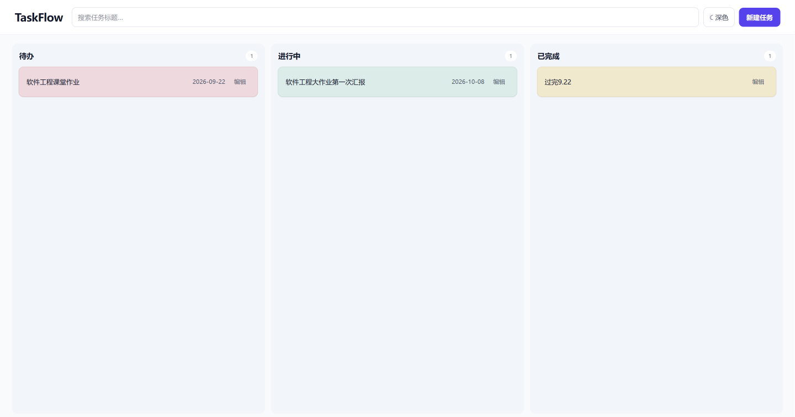
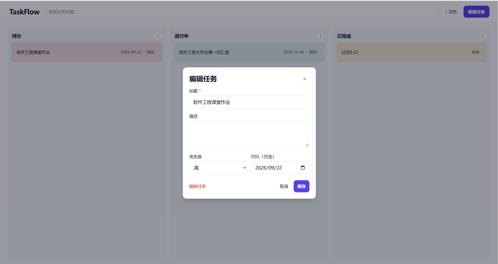
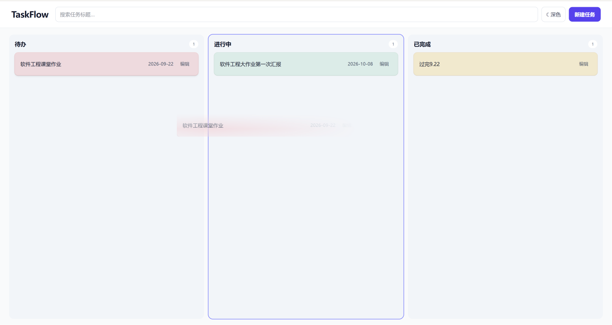
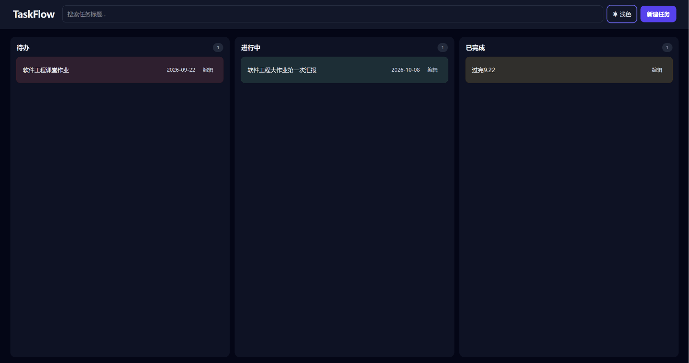
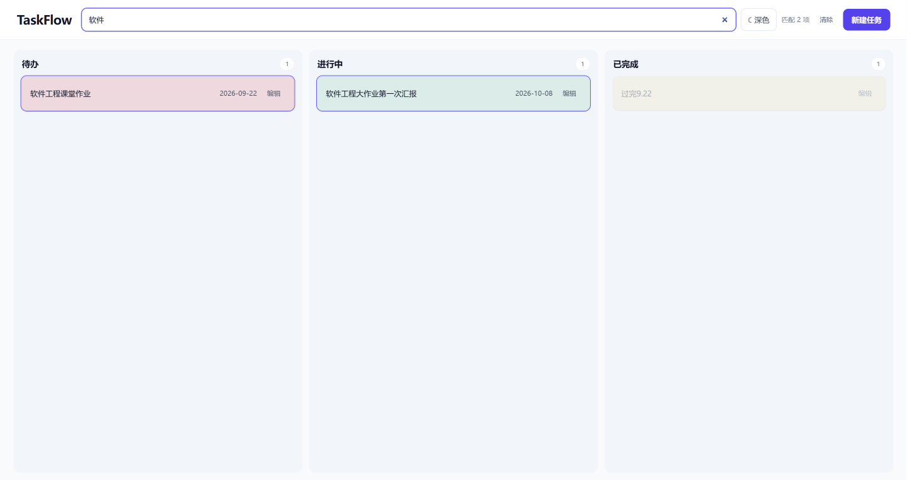

# TaskFlow

## 运行功能展示

| 浅色看板总览 | 编辑任务 |
| --- | --- |
|  |  |

| 拖拽任务 | 深色模式 |
| --- | --- |
|  |  |

| 搜索任务 |
| --- |
|  |

一个基于 Vue 3、Vite、Tailwind CSS 和 localStorage 的本地任务看板。

## 技术栈

- Vue 3（Composition API）
- Vite
- Tailwind CSS v4
- 浏览器 `localStorage`

## 启动

```bash
npm install
npm run dev
```

## 项目结构

```text
src/
├── components/
│   ├── board/       # 看板列、任务卡片、任务编辑弹窗
│   └── layout/      # 页面顶部与整体布局
├── composables/     # useTasks、useTheme 等状态与行为
├── constants/       # 状态、优先级等领域常量
├── services/        # localStorage 访问层
├── styles/          # Tailwind 入口与全局样式
├── types/           # JSDoc 类型定义
├── App.vue
└── main.js
```

## 任务模型

```js
{
  id: 'uuid',
  title: '任务标题',
  description: '可选描述',
  priority: 'high' | 'medium' | 'low',
  status: 'todo' | 'in-progress' | 'done',
  deadline: 'YYYY-MM-DD（可选）'
}
```

## 后续实现范围

1. 任务新增、编辑、删除与表单校验
2. 三列之间的原生拖拽
3. 标题搜索和按状态筛选
4. 高 / 中 / 低优先级视觉标识
5. localStorage 持久化和深色模式记忆
